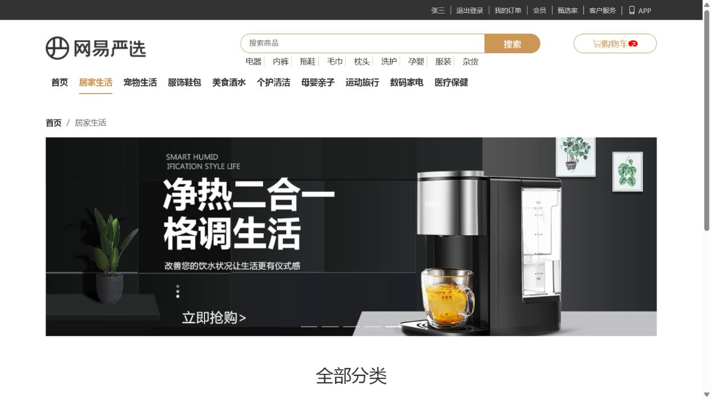

# 网易严选 Vue 3 练习项目

一个基于 Vue 3 与 Vue CLI 5 搭建的网易严选商城前端练习项目。项目目前实现了首页商品展示、分类导航与分类页，并通过 Vuex 管理分类和用户状态，通过 Axios 统一访问网易公开接口及本地 Mock 服务。

> 本项目用于前端工程化与组件化学习，并非网易严选官方项目。登录、搜索、购物车、下单等完整业务尚未实现。

## 运行效果

### 首页


### 分类页



## 技术栈

- Vue 3.2
- Vue Router 4（Hash 路由）
- Vuex 4
- Axios
- Element Plus
- Less
- Vue CLI 5
- Express 5（本地 Mock 服务）

## 已实现功能

- 公共布局：顶部导航、搜索头部、分类导航和内容区域
- 首页轮播图
- “新鲜好物”商品列表，包含骨架屏、空状态、错误状态和重新加载
- “人气推荐”商品列表
- 首页分类产品区块与通用商品卡片
- 分类导航下拉面板
- 分类页面包屑、轮播图和子分类展示
- Vuex 模块化状态管理
- Axios 实例与接口模块封装
- 全局组件注册：轮播图、更多入口、骨架占位
- 桌面端、平板端和移动端基础响应式布局

## 当前未完成内容

- 登录页仅有占位内容，用户信息为 Vuex 中的模拟数据
- 搜索、购物车、订单和商品详情暂无真实交互
- 多数商品链接与“查看全部”仍指向首页或占位地址
- 页面底部仍为占位区域
- 本地 Mock 服务尚未集成到 npm scripts，需要单独启动

## 环境要求

- Node.js 18 或更高版本（Express 5 要求 Node.js >= 18）
- npm

本项目已在 Node.js 22.19.0、npm 10.9.3 环境下完成构建验证。

## 安装依赖

进入本目录后执行：

```bash
npm install
```

## 本地开发

项目同时使用远程接口和本地 Mock 接口。完整查看首页内容时，需要开启两个终端。

终端一：启动本地 Mock 服务，默认监听 `http://localhost:7788`。

```bash
node server/index.js
```

终端二：启动 Vue 开发服务器。

```bash
npm run serve
```

启动成功后，按照终端输出的地址访问项目，通常为 `http://localhost:8080`。

如果未启动本地 Mock 服务，轮播图、人气推荐和首页产品区块将无法获取数据；分类导航和“新鲜好物”还需要能够访问网易严选远程接口。

## 构建

```bash
npm run build
```

构建产物输出到 `dist/`。当前构建可以成功完成，但 vendor 包包含完整的 Element Plus，构建工具会提示资源体积超过推荐值；如需用于生产环境，可进一步采用按需引入和路由/组件拆包优化体积。

## 路由

| 地址 | 页面 | 状态 |
| --- | --- | --- |
| `/#/` | 首页 | 已实现主要展示模块 |
| `/#/category/:id` | 分类页 | 已实现轮播图与子分类展示 |
| `/#/login` | 登录页 | 占位页面 |

## 数据来源与开发代理

开发环境代理配置位于 `vue.config.js`：

| 前缀 | 目标服务 | 用途 |
| --- | --- | --- |
| `/api` | `https://you.163.com` | 分类数据、新鲜好物 |
| `/foo` | `http://localhost:7788` | 轮播图、人气推荐、首页产品区块 |

Axios 请求封装位于 `src/api/req.js`，接口地址集中维护在 `src/api/base.js`，请求函数统一从 `src/api/index.js` 导出。

## 项目结构

```text
vue3-yanxuan/
├─ public/                 # HTML 模板与静态资源
├─ server/                 # Express 本地 Mock 服务
│  ├─ data/                # 首页 Mock 数据
│  ├─ router/              # Mock 接口路由
│  └─ index.js             # 服务入口（端口 7788）
├─ src/
│  ├─ api/                 # Axios 实例、接口地址与请求函数
│  ├─ assets/              # 图片和全局样式
│  ├─ components/          # 公共业务组件
│  │  ├─ library/          # 全局注册组件
│  │  └─ Skeleton/         # 页面骨架屏组件
│  ├─ router/              # 路由配置
│  ├─ store/               # Vuex Store 与业务模块
│  ├─ utils/               # 常量等工具代码
│  ├─ views/               # 布局页、首页、分类页和登录页
│  ├─ App.vue              # 根组件
│  └─ main.js              # 应用入口与插件装配
├─ vue.config.js           # Less 全局资源与开发代理配置
└─ package.json            # 依赖及 npm scripts
```

## 核心设计

### 状态管理

- `category` 模块负责加载并保存顶部分类数据；请求失败时使用本地常量作为基础导航。
- `user` 模块目前仅用于演示命名空间、mutation 和异步 action，用户信息不是真实登录数据。

### 组件复用

- `MyPanel` 通过默认插槽和具名插槽统一首页区块结构。
- `MyGoodsItem` 负责产品区块中的商品卡片展示。
- `AppBanner`、`AppMore`、`AppSkeleton` 通过插件统一注册为全局组件。

### 页面数据流

```text
页面组件 -> src/api/index.js -> Axios 实例 -> 开发代理 -> 远程接口或本地 Mock 服务
分类导航 -> Vuex category 模块 -> 页面与导航组件共享分类状态
```

## 学习文档

- [网易严选课堂笔记](../../文档/网易严选课堂笔记.md)
- [项目阶段总结](../../文档/12-项目阶段总结.md)

## 注意事项

- 该项目依赖开发服务器代理；直接打开构建后的 HTML 文件不能替代正常的静态服务器部署。
- 网易远程接口并非本项目维护，其字段、可用性和访问策略可能发生变化。
- 仓库暂未配置 lint、单元测试或端到端测试脚本，提交改动前至少应执行 `npm run build`。
